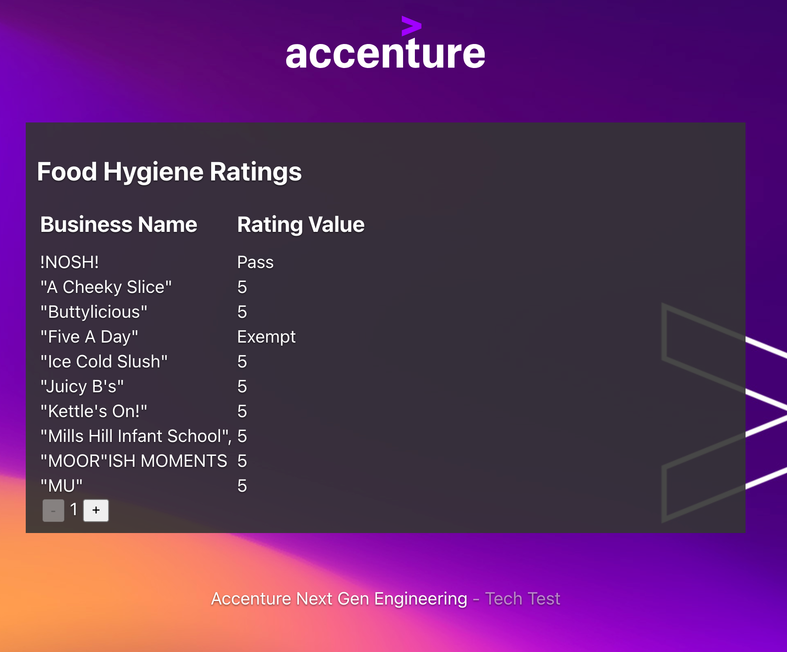

# Accenture Next Gen Engineering - React TypeScript Tech Test

## Paired Programming Exercise

### _Introduction:_

This Paired Programming Exercise is designed to assess a candidate's problem-solving skills and their comfort level with React and Typescript. Paired programming is a collaborative coding approach where two individuals work together to solve a problem or complete a programming task. This exercise provides a valuable opportunity for both the candidate and the interviewer to interact, exchange ideas, and assess the candidate's technical abilities in a real-time setting.

### _Objective:_

The primary objective of this exercise is to evaluate the candidate's proficiency in programming, problem-solving skills, and their ability to work effectively in a team. By pairing up with the candidate, the interviewer can gain insights into the candidate's thought process, coding techniques, and their ability to communicate and collaborate on a technical project.

## Prerequisites

- Node.js >=18
- Access to the internet
- Suitable development environment

## Getting Started

- Install dependencies: `npm install`
- Run it: `npm run dev`
- Test it: `npm run test`
- View it: http://localhost:5173
